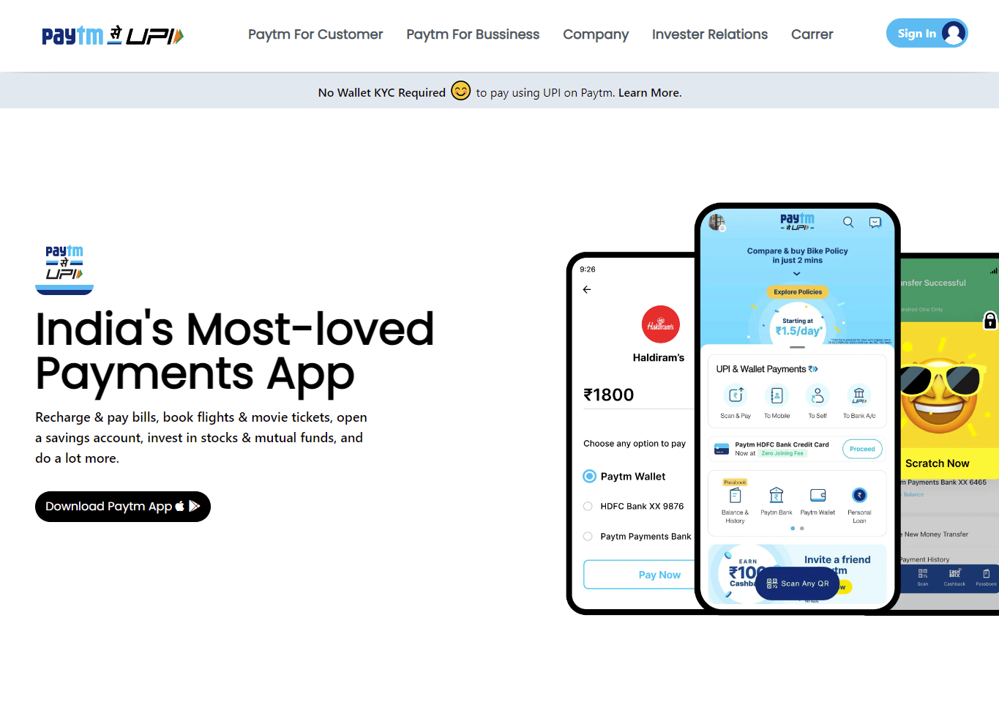
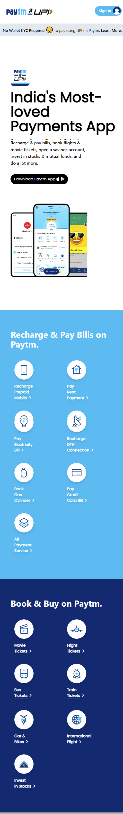

# Assignment - 16

## Project 16 [Live Link](https://paytm-clone.netlify.app/)

- ### skills used in project
  - Learn tailwindCSS Properties, Grid, flexbox etc.
  - Learn Responsive design using tailwindCSS.
  - Total time taken 12hr to complete.
## Screenshot
### Desktop

### Mobile Responsive
